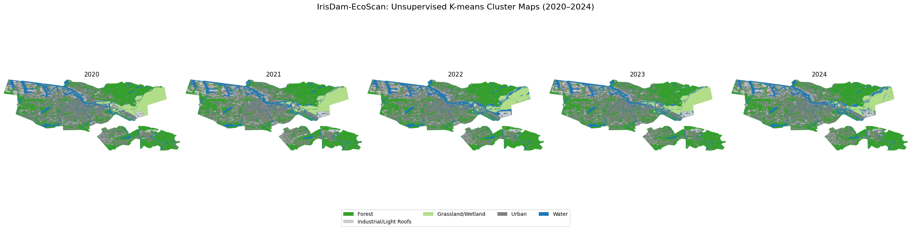
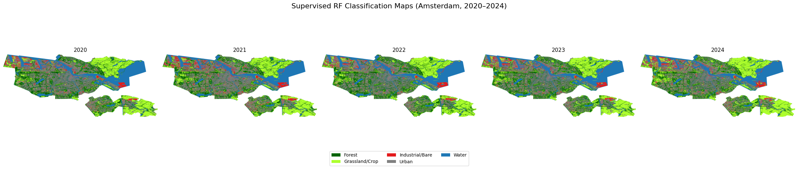

# Temporal-Land-Cover-Classification-of-Amsterdam-2020-2024-
Land Cover Classification of Amsterdam (2020-2024) using Random Forest and Sentinel-2 imagery. Features multi-temporal analysis, spectral index engineering (NDVI/NDWI/NDBI), and comparison with K-Means clustering.
This project compares an unsupervised K-means clustering workflow with a supervised Random Forest model for annual land-cover mapping over Amsterdam. 
The study assesses accuracy, temporal consistency and carbon footprint, demonstrating how choice of algorithm affects both performance and sustainability.

---

<strong>Table of Contents</strong>

1. [Project Motivation and Background](#1--project-motivation-and-background)  
2. [Data Source and Pre-processing](#2--data-source-and-pre-processing)  
3. [Method Overview](#3--method-overview)  
   * [3.1 Unsupervised K-Means](#31--unsupervised-k-means)  
   * [3.2 Supervised Random Forest](#32--supervised-random-forest)  
4. [Notebooks and Quick Start](#4--notebooks-and-quick-start)  
5. [Results](#5--results)  
6. [Environmental Cost](#6--environmental-cost)  
7. [Walk-through Video](#7--walk-through-video)  
8. [References & Acknowledgements](#8--references--acknowledgements)

---

## 1  Project Motivation and Background
Urban land-cover mapping remains a significant challenge in remote sensing due to high spectral heterogeneity and the prevalence of "mixed pixels" in dense cityscapes (Weng, 2012). As urban areas like Amsterdam face increasing pressure from climate change and densification, precise monitoring of land-use dynamics is essential for sustainable development (UN-Habitat, 2020).

While Supervised algorithms, particularly **Random Forest (RF)**, are widely praised for their ability to handle high-dimensional satellite data and provide robust classification (Belgiu & Drăguţ, 2016), they are inherently limited by the availability and quality of labeled training samples. In contrast, **Unsupervised techniques** like **K-means clustering** offer a "data-driven" alternative that groups pixels based on intrinsic spectral similarities without prior knowledge (Gorelick et al., 2017).

This project utilizes Sentinel-2 multi-spectral imagery to conduct a comparative study of RF and K-means over Amsterdam (2020–2024). Beyond mere pixel accuracy, this research evaluates feature importance—specifically the role of Short-Wave Infrared (SWIR) bands in urban discrimination—as well as the computational environmental cost of each method. By doing so, the project investigates:

> *whether unsupervised clustering can serve as a reliable, low-emission proxy for urban monitoring in scenarios where high-quality ground truth labels are scarce?*

  
  
<em>Figure&nbsp;1 Study area – the London Borough of Waltham Forest (map produced in QGIS).</em>

---

## 2  Data Source and Pre-processing
The project utilizes **Sentinel-2 Level-2A (Surface Reflectance) data** accessed via the Google Earth Engine (GEE) data catalog.

| Step | Detail |
|------|--------|
| **Time window** | April–August each year (2020–2024) – peak “leaf-on” season improves spectral contrast. |
| **Spectral bands** | B2 (Blue), B3 (Green), B4 (Red), B8 (NIR), B11 (SWIR1), B12 (SWIR2) plus derived **NDVI** **NDWI** and **NDBI**. |
| **Cloud & shadow masking** | Sentinel-2 Scene Classification Layer (SCL) used to exclude clouds, cirrus and their shadows. |
| **Radiometric normalisation** | Pixel values clipped to the 2nd–98th percentile and scaled to \[0, 1] using 2021 as the reference year. |
| **Area of interest** | The administrative boundary of Amsterdam (Municipality of Amsterdam) was sourced from the geoBoundaries Global Database (ADM2). |

All processing steps are executed in  **`01_preprocessing.ipynb`**, exporting yearly 8-band 10 m GeoTIFFs to Google Drive.

---

## 3  Method Overview
Both models share the pre-processing pipeline described above and then diverge as follows.

### 3.1  Unsupervised K-Means

  
  
<em>Figure&nbsp;2 K-means clustering workflow (see <code>02_unsupervised_kmeans.ipynb</code>).</em>

* **Sample & scale** 50 000 pixels from the 2021 composite are scaled (StandardScaler). K-means relies on Euclidean distance. Since the Near-Infrared (NIR) band often has higher reflectance values than the Blue band, the data must be scaled.
* **Cluster selection** *k* = 5  To avoid arbitrary selection, the Elbow Method is used by plotting the Within-Cluster Sum of Squares (WCSS) against various values of $k$.
* **Semantic interpretation** By comparing the cluster's mean spectral signature to known land-cover profiles (e.g., Water has low NIR; Vegetation has high NIR), we manually assign labels:
    0: "Forest ",
    1: "Industrial/Light Roofs ",
    2: "Grassland/Wetland ",
    3: "Urban ",
    4: "Water

  
  
<em>Figure&nbsp;3 Conceptual diagram of K-means clustering.</em>

### 3.2  Supervised Random Forest

  
  
<em>Figure&nbsp;4 Random-Forest workflow (see <code>03_supervised_randomforest.ipynb</code>).</em>

* **Training data** 250 points × 4 classes from **ESA WorldCover 2021**.  
* **Model** 300-tree Random Forest, An **80/20 train-test split** was employed. The model was trained on a balanced dataset to prevent bias toward the dominant 'Urban' class.
* **Feature importance** We utilized SHAP (SHapley Additive exPlanations) values. Unlike traditional "Gini importance," SHAP provides a more nuanced view of how each spectral band contributes to a specific pixel's classification.
* **Performance on 2021 hold-out set**

  | Metric | Score |
  |--------|------:|
  | Overall accuracy | 0.82 |
  | Cohen’s κ | 0.78 |
  | F1 (urban) | 0.74 |
  | F1 (water) | 0.95 |

Random Forest offers robust classification and superior stability for consistent features like water. However, it relies heavily on prior labels and may merge spectrally distinct urban subclasses (e.g., different roofing materials) that K-means clustering successfully keeps separate due to its sensitivity to raw spectral variance.

---

## 4  Notebooks and Quick Start
| Notebook | Purpose |
|----------|---------|
| **`01_preprocessing.ipynb`** | Download and prepare Sentinel-2 composites. |
| **`02_unsupervised_kmeans.ipynb`** | Fit and apply K-means model. |
| **`03_supervised_randomforest.ipynb`** | Train Random Forest, run inference and compare results. |

> **Quick start** Clone the repo, open each notebook in Google Colab and run top-to-bottom. No local installs required.

---

## 5  Results
<table>
<tr><th style="text-align:center">Figure</th><th>Description</th></tr>
<tr>
<td></td>
<td><strong>Figure 5.</strong> K-means classifications (2020 → 2024), shown as an animated GIF to illustrate year-on-year change.</td>
</tr>
<tr>
<td></td>
<td><strong>Figure 6.</strong> Random-Forest classifications (2020 → 2024), shown as an animated GIF to illustrate year-on-year change.</td>
</tr>
<tr>
<td></td>
<td><strong>Figure 7.</strong> Urban gain (red) and vegetation loss (yellow), 2020–2024. RF detects more change due to its sensitivity to subtle spectral shifts; K-means is more conservative and stable in its outputs.</td>
</tr>
<tr>
<td></td>
<td><strong>Figure 8.</strong> Feature importance from the Random Forest model. NIR and SWIR2 dominate.</td>
</tr>

</table>

### 5.1  Land-Cover Area Comparison (2024)

| Class | Random Forest (%) | K-means (%) | Comment |
|-------|------------------:|------------:|---------|
| Urban | 28.27 | 32.26 | RF underestimates urban compared to K-means |
| Industrial | 5.08 | 8.4 | RF merges this into general urban, K-Means separates it |
| Vegetation | 47.51 | 46.65 | RF likely over-assigns vegetated pixels |
| Water | 19.15 | 12.69 | High agreement between methods |

#### 5.2  Key Insights and Observations
* **Urban spectral sub-types** K-means reveals an additional cluster, industrial/light-roofed buildings (e.g., schools, depots), missed by RF. These have distinct spectral traits (low NIR, high SWIR), adding structural detail without semantic labels. RF provides clearer classes but may overlook such intra-urban variation.
* **Vegetation assignment differs** RF maps more vegetation, likely due to its sensitivity to NDVI-rich mixed pixels in semi-urban areas. K-means is stricter, reducing overclassification but risking omission of shaded or sparse vegetation.
* **Hydrological stability** Both models show <2 % variation in open-water extent.  
* **Change-detection divergence** RF shows a +14.1 % increase in urban area, while K-means suggests a −7.8 % decrease. The RF model, trained on static labels, offers consistency in class definitions but is sensitive at the pixel level, producing more visible red/yellow noise in the change map (Fig. 7). K-means, meanwhile, yields smoother maps but greater year-on-year variation in total class areas, due to its sensitivity to spectral drift and threshold shifts. This illustrates a trade-off: RF is more stable categorically, K-means spectrally.

#### 5.3  Limitations
* **Label dependence (RF)** Sub-classes are collapsed to the labels present in ESA WorldCover.  
* **Cluster interpretation (K-means)** Requires manual labelling post hoc; risk of mis-classifying transitional pixels.  
* **Temporal stability** Because centroids were based on 2021 data, K-means shows more year-to-year variation. RF, trained on labels from each year, offers more stable temporal comparisons.
* **Subjectivity of “urban”** Definitions of “urban” vary. Rooftops, roads, bare soil, and even carparks may be included or excluded depending on the method. This project doesn’t solve that ambiguity, but visual side-by-sides help reveal what each model is actually capturing.

---

## 6  Environmental Cost
This project incorporates environmental accountability by tracking the computational energy usage and estimated carbon emissions associated with each stage of the workflow. While the emissions are minimal in absolute terms, the broader goal is to cultivate sustainable habits in spatial computing and remote sensing research.

| Stage           | Runtime (hrs) | Energy (kWh) |  CO₂e (g) |    Cost (€) | Notes                   |
| --------------- | ------------: | -----------: | --------: | ----------: | ----------------------- |
| Preprocessing   |        0.0254 |     0.000507 |     0.165 |      0.0002 | GEE export + rescaling  |
| K-Means (k = 4) |        0.1418 |     0.002836 |     0.922 |      0.0010 | Cluster fit + inference |
| Random Forest   |        0.1384 |     0.002768 |     0.900 |      0.0010 | Train, predict, compare |
| **Total**       |    **0.3056** | **0.006111** | **1.987** | **€0.0022** | All stages, CPU only    |

*Assumptions: 20 W CPU, 0.325 kg CO₂/kWh (Netherlands grid average), €0.35/kWh.*

At just under **1 g CO₂e**, the entire analysis emitted less than:

- 1 minute of HD video streaming
- Boiling ⅒ of a kettle
- Driving ~5 meters in a petrol car

#### 6.1  Context and Mitigation  
* **Efficient compute:**  Executed on CPU-only Google Colab sessions (<12 min), using carbon-neutral infrastructure with no GPU or fine-tuning.

* **Minimal data load:**  Used only a tiny fraction (<0.00002%) of Sentinel-2’s total capacity, whose emissions are amortised globally, plus no heavy raster storage or repeated compute.

* **Code efficiency:**  Modular, single-pass pipelines avoided redundancy, and reusable notebooks reduce future re-runs.

* **Scalability concerns:**  Expanding to a full metro area (e.g., Greater London) could multiply emissions ~6×. Choosing carbon-aware Colab region using carbon-aware Colab Pro (e.g., `europe-north1`, `us-west1`) can reduce emissions by up to 80%.

* **Low-carbon modelling choices:** Unsupervised methods like K-Means offer lower-carbon alternatives in scenarios where labelled data is unavailable or overfitting is a risk.

Ultimately, while this project’s carbon footprint is scientifically negligible, its carbon accounting reflects a responsible approach to computational geography. As machine learning expands in environmental domains, even small efficiencies can add up to meaningful impact.

---

## 7  Walk-through Video
A short walk-through (7 min) covering data, code and results is available on YouTube:  

---

## 8  References & Acknowledgements
This repository was developed as a final project for the UCL undergraduate module **GEOL0069 Artificial Intelligence for Earth Observation**.  
Special thanks to **Dr Michel Tsamados**, **Weibin Chen** and **Connor Nelson** for the original notebooks and teaching materials that formed the basis for this work.

### 8.1  Reference List 
* Belgiu, M. and Drăguţ, L. (2016) ‘Random forest in remote sensing: A review of applications and future directions’, ISPRS Journal of Photogrammetry and Remote Sensing, 114, pp. 24–31.

* Bouza Heguerte, L., Bugeau, A. and Lannelongue, L. (2023) ‘How to estimate carbon footprint when training deep learning models? A guide and review’, Environmental Research Communications. Available at: https://doi.org/10.1088/2515-7620/acf81b

* Gorelick, N., Hancher, M., Dixon, M., Ilyushchenko, S., Thau, D. and Moore, R. (2017) ‘Google Earth Engine: Planetary-scale geospatial analysis for everyone’, Remote Sensing of Environment, 202, pp. 18–27.

* Lundberg, S. M. and Lee, S. I. (2017) ‘A Unified Approach to Interpreting Model Predictions’, Advances in Neural Information Processing Systems (NeurIPS), 30.

* Medium (2024) ‘Understanding how K-means clustering works – a detailed guide’. Available at: https://levelup.gitconnected.com/understanding-how-k-means-clustering-works-a-detailed-guide-9a2f8009a279

* Naushad, R. (2023) Land-cover classification using Sentinel-2 dataset (deep learning). GitHub. Available at: https://github.com/raoofnaushad/Land-Cover-Classification-using-Sentinel-2-Dataset

* Strubell, E., Ganesh, A. and McCallum, A. (2020) ‘Energy and policy considerations for modern deep learning research’, Proceedings of the AAAI Conference on Artificial Intelligence. Available at: https://doi.org/10.1609/aaai.v34i09.7123 (Accessed 8 June 2025).

* Tingzon, I. and Mahesh, A. (2024) Land-use and land-cover classification using deep learning (Tutorial). Climate Change AI Summer School. Available at: https://doi.org/10.5281/zenodo.11584954

* Tsamados, M. and Chen, W. (2022) GEOL0069: Artificial Intelligence for Earth Observation – course notebook. University College London. Available at: https://cpomucl.github.io/GEOL0069-AI4EO/intro.html

* UN-Habitat (2020) World Cities Report 2020: The value of sustainable urbanisation. United Nations Human Settlements Programme. Available at: https://unhabitat.org/sites/default/files/2020/10/wcr_2020_report.pdf (Accessed 8 June 2025).

* Weng, Q. (2012) ‘Remote sensing of impervious surfaces in urban areas: Requirements, methods and trends’, Remote Sensing of Environment. Available at: https://doi.org/10.1016/j.rse.2011.02.030

---
